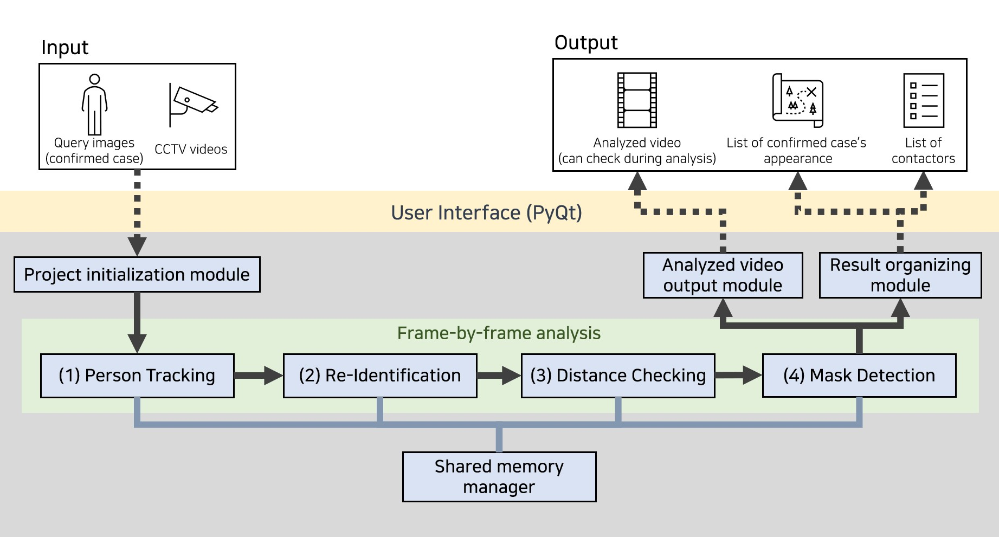
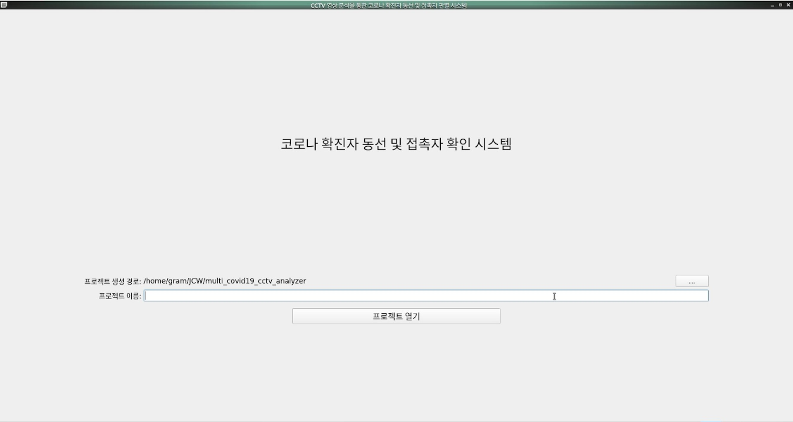
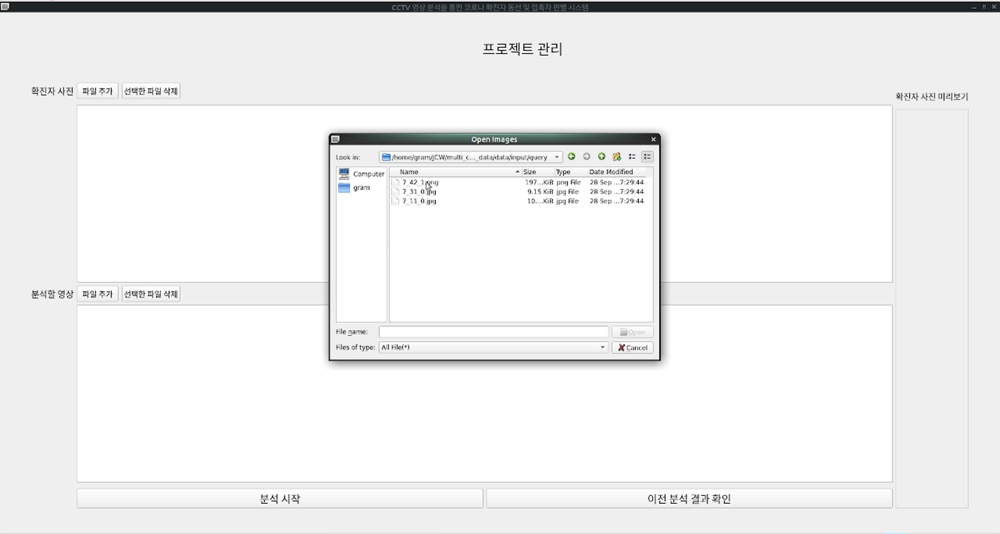
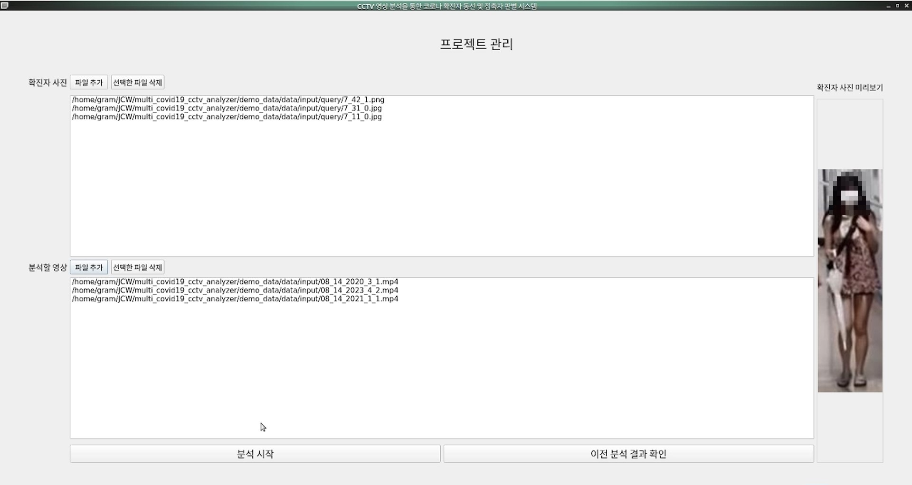
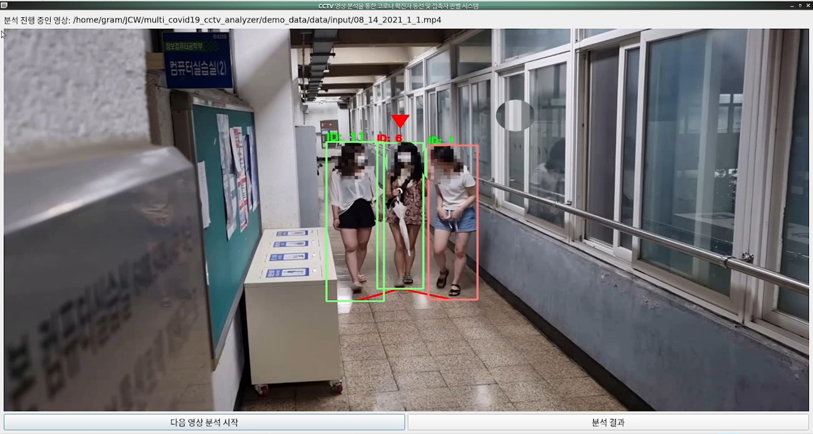
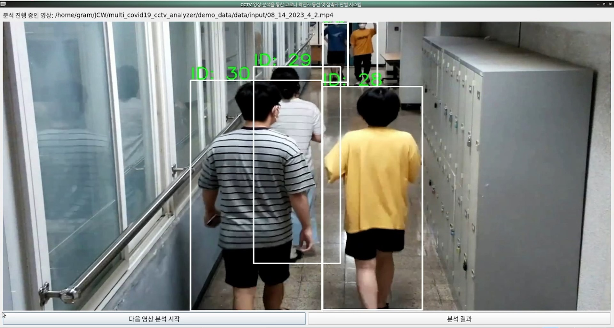
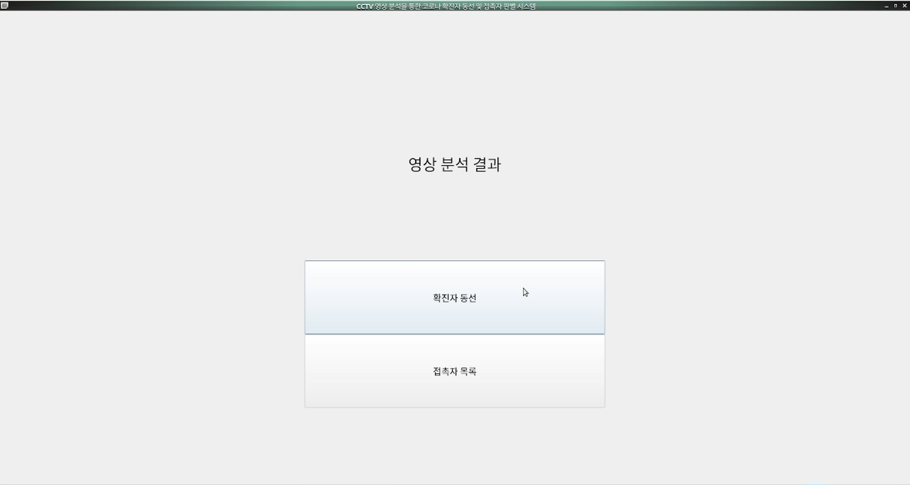
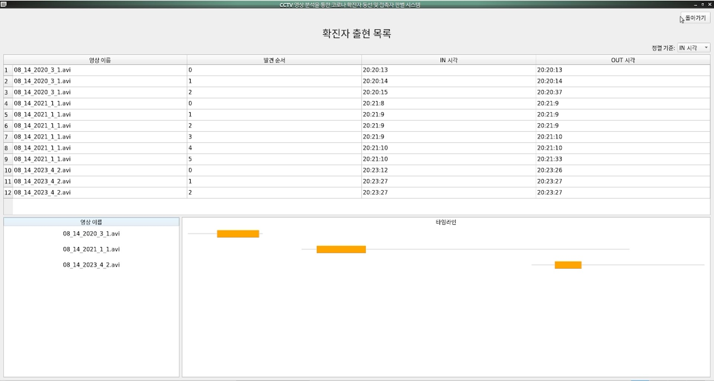
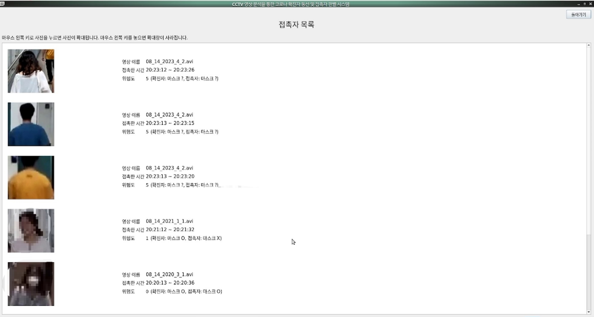
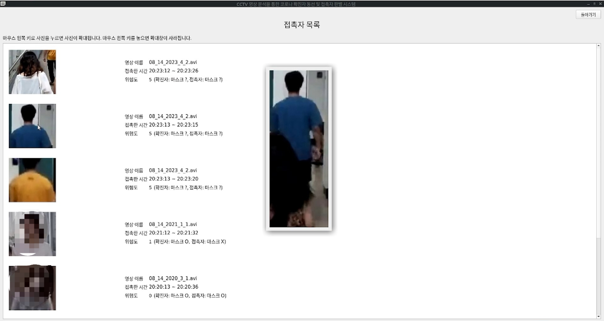

# System Structure

# System operstion










아직 Person re-identification의 정확도가 높지 못하다.
# Getting Start
## Requirements
- conda 4.10.1
## Setting
아래를 순서대로 실행한다.
```
$ conda env create -f environment.yml
```
```
$ cd deep-sort-yolo4
$ ./model_data/download_weights.sh
$ python convert.py
```
```
$ cd personReid/top-dropblock
$ ./weight/download_weights.sh
```
```
$ cd personReid/LA_Transformer
$ ./download_weights.sh
```
## Optional Setting
`configs/runInfo.py`에서 세부 설정 값을 변경할 수 있다.
- `input_video_path` : 분석할 입력 영상 경로
- `output_video_path` : 출력 영상 경로
- `start_frame` : 입력 영상에서 분석을 시작할 frame 시점
- `end_frame` : 입력 영상에서 분석을 종료할 frame 시점
- `query_image_path` : 확진자의 사진을 넣을 디렉토리 경로
## Execution
UI를 사용하여 실행하고 싶을 경우 아래와 같이 실행한다.
```
$ python application.py
```
UI 없이 `configs/runInfo.py`의 설정대로 실행하여 출력 영상 및 파일만 생성하고 싶을 경우 아래와 같이 실행한다.
```
$ python run.py
```
# References
- Deep-SORT-YOLOv4: https://github.com/LeonLok/Deep-SORT-YOLOv4
- top-dropblock: https://github.com/RQuispeC/top-dropblock
- LA-transformer: https://github.com/SiddhantKapil/LA-Transformer
- AP calculation: https://github.com/herbwood/mAP